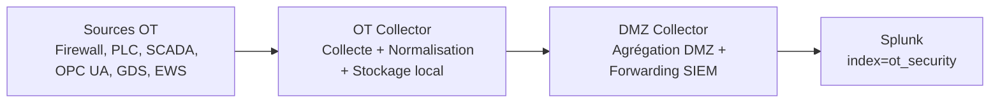

# OT Collector — Gestion, normalisation, stockage, filtrage et forwarding des événements OT

## 1. Introduction

L’OT Collector est le point de collecte, de normalisation et de contrôle des événements de cybersécurité et d’exploitation dans la zone OT (Operational Technology) du cyber-range LabShock/DataProtect.

Son rôle principal est de :
- recevoir les événements hétérogènes provenant des actifs OT ;
- transformer ces événements en un format normalisé exploitable par un SIEM ;
- conserver une trace locale robuste ;
- appliquer des décisions de filtrage/forwarding avant la traversée vers la DMZ.

Le positionnement en zone OT répond à des exigences de sûreté et de résilience :
- réduire l’exposition directe des actifs industriels ;
- limiter les dépendances réseau externes ;
- garantir la conservation locale des preuves en cas d’incident de connectivité.

Les actifs OT ne doivent pas envoyer directement vers Splunk, car cela contournerait :
- le contrôle de normalisation OT ;
- les règles de filtrage/protection des événements critiques ;
- la séparation de zones OT → DMZ → SIEM.

## 2. Position dans l’architecture

Chaîne validée : **OT Sources → OT Collector → DMZ Collector → Splunk (index=ot_security)**.



## 3. Mécanismes d’entrée

### 3.1 Syslog UDP 514
- Usage : ingestion rapide et légère de journaux réseau/système.
- Avantage : faible overhead.
- Limite : protocole non fiable (pas d’accusé de réception natif).

### 3.2 Syslog TCP 1514
- Usage : ingestion fiable lorsque la livraison doit être plus déterministe.
- Avantage : transport orienté connexion.
- Limite : overhead supérieur à UDP.

### 3.3 Événements HTTP/API (si supportés)
- Rôle : ingestion d’événements structurés émis par des composants applicatifs.
- Statut : **À valider** (selon mode de déploiement et exposition de l’endpoint d’ingestion côté OT Collector).

### 3.4 API/UI locale sur port 8088
- Rôle : supervision locale, consultation des événements, validation fonctionnelle.
- Usage : opérations de contrôle en zone OT sans dépendre directement de Splunk.

## 4. Pipeline d’ingestion des événements

Le traitement suit les étapes suivantes :

1. **Réception par un listener**
   - Syslog UDP (514) ou Syslog TCP (1514), et éventuellement API HTTP (**À valider**).
2. **Parsing brut du message**
   - formats syslog RFC3164-like, RFC5424-like, ISO syslog, message brut, syslog JSON structuré.
3. **Extraction JSON (si présent)**
   - décodage des champs structurés embarqués dans le message.
4. **Identification de la source**
   - détermination de `source_type`/identité équipement depuis le contenu et les règles.
5. **Normalisation orientée source**
   - application des mappings dérivés des références Markdown de `logs by sources/`.
6. **Enrichissement**
   - ajout de tags techniques SIEM et métadonnées de décision.
7. **Décision de filtrage/sampling**
   - application des règles de conservation, déduplication et forwarding.
8. **Stockage local**
   - écriture dans `/data/events.jsonl`.
9. **Forwarding vers DMZ Collector**
   - transfert des événements retenus pour la chaîne SOC.
10. **Exposition API/UI locale**
   - consultation, filtrage et validation opérationnelle.

## 5. Schéma d’événement normalisé

### 5.1 Champs principaux

| Champ | Description | Exemple |
|---|---|---|
| `id` | Identifiant unique de l’événement | `evt-1710000000-abc123` |
| `timestamp` | Horodatage de l’événement source | `2026-05-17T10:12:33Z` |
| `received_at` | Horodatage de réception collector | `2026-05-17T10:12:34Z` |
| `zone` | Zone de confiance | `OT` |
| `source_type` | Type de source normalisé | `gds_agent` |
| `asset_name` | Nom logique de l’actif | `OT GDS Agent` |
| `asset_ip` | IP de l’actif | `192.168.1.30` |
| `severity` | Sévérité normalisée | `warning` |
| `protocol` | Protocole observé | `syslog` |
| `event_category` | Catégorie métier/sécurité | `pki_validation` |
| `message` | Message canonique | `sync_cycle_failure` |
| `raw` | Preuve brute originale | `<ligne syslog brute>` |
| `tags.*` | Métadonnées techniques et décisionnelles | voir ci-dessous |

### 5.2 Tags attendus
- `tags.normalized=true`
- `tags.normalization_source=logs_by_sources_md`
- `tags.parser_version=v2.logs_by_sources_md`
- `tags.splunk_sourcetype`
- `tags.siem_index_hint=ot_security`
- `tags.collector_decision`
- `tags.collector_decision_hint`
- `tags.forwarding_status`
- `tags.matched_rule_id`

### 5.3 Exemple JSON

```json
{
  "id": "evt-1710000000-abc123",
  "timestamp": "2026-05-17T10:12:33Z",
  "received_at": "2026-05-17T10:12:34Z",
  "zone": "OT",
  "source_type": "gds_agent",
  "asset_name": "OT GDS Agent",
  "asset_ip": "192.168.1.30",
  "severity": "warning",
  "protocol": "syslog",
  "event_category": "pki_validation",
  "message": "sync_cycle_failure",
  "raw": "<raw syslog payload>",
  "tags": {
    "normalized": true,
    "normalization_source": "logs_by_sources_md",
    "parser_version": "v2.logs_by_sources_md",
    "splunk_sourcetype": "labshock:ot:gds",
    "siem_index_hint": "ot_security",
    "collector_decision": "store_and_forward",
    "collector_decision_hint": "high_value_or_match",
    "forwarding_status": "queued",
    "matched_rule_id": "rule-gds-sync-failure"
  }
}
```

## 6. Normalisation pilotée par les sources

La normalisation s’appuie sur des mappings maintenus depuis les références `logs by sources/`.

Objectif : transformer des logs hétérogènes (format, vocabulaire, sévérité) en événements OT homogènes, exploitables en corrélation SIEM et en dashboards.

### 6.1 Table de mapping des sources validées

| source_type | asset_name (référence) | sourcetype attendu | Événements clés validés | Dashboard readiness |
|---|---|---|---|---|
| `firewall` | OPNsense OT Firewall | `labshock:net:firewall` | `firewall_pass`, `firewall_block` | Prêt |
| `plc` | PLC/OpenPLC | `labshock:ot:plc` | `plc_login_attempt`, `plc_login_success`, `plc_user_logout`, `plc_started`, `plc_stopped` | Prêt |
| `scada` | FUXA SCADA | `labshock:ot:scada` | `scada_plc_connection_attempt`, `scada_plc_read_memory_error`, `scada_plc_connected`, `scada_polling_overload`, `scada_script_load_error`, `scada_user_created`, `scada_settings_updated`, `scada_runtime_restart`, `scada_opcua_connection_break`, `scada_opcua_certificate_san_mismatch` | Prêt |
| `opcua` | OPC UA Server | `labshock:ot:opcua` | `modbus_connection_failed`, `modbus_connection_recovered`, `certificate_verified`, `session_activated`, `unauthorized_write`, `sensitive_write_accepted`, `opcua_write_rejected` | Prêt |
| `gds_agent` | OT GDS Agent | `labshock:ot:gds` | `certificate_expiry_critical`, `certificate_inventory_drift_detected`, `gds_cert_missing_runtime`, `trustlist_diff_detected`, `sync_cycle_success`, `sync_cycle_failure` | Prêt |
| `ews` | EWS | `labshock:ot:ews` | `ews_heartbeat`, `project_file_modified`, `plc_project_modified`, `scada_project_modified`, `suspicious_file_change`, `private_key_access_attempt_or_skip` | Prêt |

## 7. Règles de parsing et d’enrichissement

Les règles d’enrichissement/normalisation visent la stabilité analytique inter-sources.

- **Normalisation de sévérité** : harmonisation (`info`, `warning`, `critical`, etc.) malgré les vocabulaires natifs.
- **Normalisation de `event_category`** : regroupement par familles de risque/opération.
- **Canonicalisation message/event_type** : convergence vers des identifiants d’événements stables.
- **Préservation du brut (`raw`)** : conservation de la preuve originale pour investigation forensique.
- **Stabilité de l’identité source** : cohérence de `source_type`, `asset_name`, `asset_ip` dans le temps.
- **Assignation `splunk_sourcetype`** : pilotée par `source_type` et mapping validé.
- **Versioning parser** : `tags.parser_version=v2.logs_by_sources_md` pour traçabilité des évolutions.
- **Préservation `original_message`** : si présent dans le flux entrant, conservation sans perte (**À valider** selon format d’entrée).

## 8. Logique de filtrage et de forwarding

Le collecteur applique une politique de décision explicite avant sortie OT :

- `collector_decision` : décision finale (ex. `store_only`, `store_and_forward`, `drop`).
- `collector_decision_hint` : raison synthétique de la décision (règle de bruit, valeur sécurité, etc.).
- `store_only` : stockage local sans forwarding.
- `store_and_forward` : stockage local puis transfert vers DMZ Collector.
- **Sampling / drop** : réduction du bruit contrôlée pour événements non critiques.
- **Deduplication** : limitation des doublons rapprochés.
- `forwarding_status` : état de forwarding (ex. `queued`, `forwarded`, `failed`).
- `matched_rule_id` : identifiant de la règle ayant influencé la décision.

Principe de sûreté : le stockage local précède la décision de forwarding afin de préserver la traçabilité OT.

## 9. Protection des événements à haute valeur

Les événements suivants ne doivent jamais être perdus par des règles agressives de bruit/sampling :

- `firewall_block`
- `plc_login_attempt`
- `plc_login_success`
- `plc_stopped`
- `scada_opcua_connection_break`
- `scada_script_load_error`
- `scada_user_created`
- `scada_settings_updated`
- `modbus_connection_failed`
- `unauthorized_write`
- `sensitive_write_accepted`
- `certificate_expiry_critical`
- `gds_cert_missing_runtime`
- `private_key_access_attempt_or_skip`
- `suspicious_file_change`

Ces signaux doivent rester en **priorité de conservation et forwarding**.

## 10. Stockage local

Le stockage local se fait dans `/data/events.jsonl` (JSON Lines).

Bénéfices OT :
- **Résilience** : continuité de collecte si le lien vers DMZ est perturbé.
- **Traçabilité** : historique consultable localement pour audit/forensic.
- **Buffering opérationnel** : reprise de forwarding après incident réseau.
- **Validation terrain** : vérification rapide des parsers/règles au plus près des actifs.

## 11. Rôle de l’API/UI locale

L’API/UI locale (port 8088) sert de plan de contrôle OT pour :
- visibilité des flux et de l’état du collecteur ;
- revue d’événements normalisés ;
- filtrage par source/sévérité/catégorie ;
- validation des mappings de parsing ;
- contrôle de la santé des sources et de la chaîne de forwarding.

## 12. Commandes de validation

> Adapter les noms de conteneurs/interfaces selon l’environnement LabShock déployé.

### 12.1 Vérifier les listeners

```bash
ss -lunpt | grep -E ':514|:1514|:8088'
```

### 12.2 Vérifier IP et routage

```bash
ip addr
ip route
```

### 12.3 Vérifier le stockage local JSONL

```bash
ls -lh /data/events.jsonl
tail -n 20 /data/events.jsonl | jq
```

### 12.4 Injecter un test UDP syslog

```bash
logger -n 127.0.0.1 -P 514 -d '<134>May 17 12:00:00 ot-plc01 plc-auth: login attempt user=operator result=failed'
```

### 12.5 Contrôler les événements normalisés par source

```bash
curl -s http://127.0.0.1:8088/events?limit=2000 \
| jq -r 'group_by(.source_type)[] | {source_type: .[0].source_type, count: length}'
```

### 12.6 Vérifier la couverture parser_version

```bash
curl -s http://127.0.0.1:8088/events?limit=5000 \
| jq -r '.[].tags.parser_version' | sort | uniq -c
```

## 13. Validation Splunk (SPL)

### 13.1 Tous les flux par source_type

```spl
index=ot_security
| stats count by source_type
| sort - count
```

### 13.2 Événements non normalisés

```spl
index=ot_security
| where isnull(tags.normalized) OR tags.normalized!=true
| table _time host source_type message raw tags.*
```

### 13.3 Événements sans sourcetype OT attendu

```spl
index=ot_security
| where isnull(tags.splunk_sourcetype) OR tags.splunk_sourcetype=""
| table _time host source_type message tags.*
```

### 13.4 Candidats d’alerte (haute valeur)

```spl
index=ot_security (
  message="firewall_block" OR
  message="plc_login_attempt" OR
  message="plc_login_success" OR
  message="plc_stopped" OR
  message="scada_opcua_connection_break" OR
  message="scada_script_load_error" OR
  message="scada_user_created" OR
  message="scada_settings_updated" OR
  message="modbus_connection_failed" OR
  message="unauthorized_write" OR
  message="sensitive_write_accepted" OR
  message="certificate_expiry_critical" OR
  message="gds_cert_missing_runtime" OR
  message="private_key_access_attempt_or_skip" OR
  message="suspicious_file_change"
)
| table _time host source_type severity message event_category tags.collector_decision tags.forwarding_status
| sort - _time
```

### 13.5 Dernier événement par source

```spl
index=ot_security
| stats latest(_time) as last_seen, latest(message) as last_message by source_type, host
| convert ctime(last_seen)
| sort source_type
```

### 13.6 Couverture parser_version

```spl
index=ot_security
| stats count by tags.parser_version
| sort - count
```

## 14. Limites connues / backlog

- Seuils de répétition sur erreurs SCADA de lecture mémoire (`scada_plc_read_memory_error`) : **À valider**.
- Validation finale de la source client FUXA GDS (si scénario partiellement couvert) : **À valider**.
- Tuning de bruit sur logs heartbeat/startup : **À valider**.
- Raffinement dashboards après période de baselining OT : **À valider**.

## 15. Conclusion

L’OT Collector constitue le point de contrôle OT côté collecte : il réceptionne des flux hétérogènes, normalise avec des règles orientées source, enrichit pour l’analyse SIEM, conserve localement la preuve, puis transmet vers la DMZ selon une logique de décision maîtrisée.

Dans l’architecture LabShock/DataProtect, il est le **pivot de qualité et de gouvernance des événements OT** avant franchissement de zone vers le DMZ Collector puis Splunk (`index=ot_security`).
